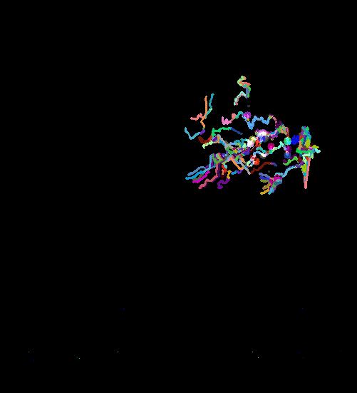

## Using Optical Flow to Derive Horizontal Velocities of Equatorial Plasma Bubbles
* goal of this project is to find horizontal drift velocities based on differences in total electron content over time
* acknowledgements to Dr. R. Pradipta for support and providing the data & Mrs. Croce and Dr. Arrigoni for additional support

### data:
* 480 txt files (each corresponds to a point in time; increment 3 mins apart)
	* only first 110 frames considered
* Each txt file contains 551 lines (each corresponds to different latitude; increment by 0.2°)
* and each line contains 501 numbers (each column corresponds to different longitude; increment by 0.2°)
* each value is a TEC reading at that location and time; one unit is 1016 electrons/m2
	* negative values represent depletions

* note: data in input & output files not published on github because of size limitations

### analysis
* read in data as consecutive image frames
* using optical flow to give motion vectors to images ~ treat like a video
* use output vectors of depletions (figure 1) to calculate average velocities of moving depletions

 
** Figure 1 **
These are the output vectors from optical flow. Each individual arrow represents the path of a detected feature. 50 features were detected, some of which belong to the same depletion.
